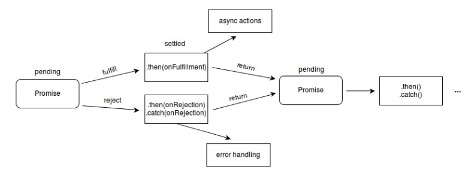

# Promise及实现Promise

```promise```对象用于表示一个异步操作的最终完成（或失败），及其结果值。

## 状态

* pending 初始状态，既不是成功，也不是失败状态
* fulfilled 成功
* rejected 失败

### 状态图




## 语法

```javascript
new Promise(function(resolve,reject){})
```

```promise```里面的executor是一个接收```resolve```和```reject```两个参数的函数。executor通常是一些异步函数。执行此异步函数时，```promise```的状态为```pending```,在此异步函数成功后会调用```resolve```将```promise```的状态改为```fulfilled```,失败后会调用```reject```将```promise```的状态改为```rejected```.状态定好后则不能再改变。在状态定好后则会调用```promise```对象的```then```方法绑定的处理方法（```then```方法包含两个参数：```onfulfilled``` 和 ```onrejected```，它们都是 Function 类型。当```promise```状态为```fulfilled```时，调用 ```then``` 的 ```onfulfilled``` 方法，当```Promise```状态为```rejected```时，调用``` then``` 的``` onrejected``` 方法， 所以在异步操作的完成和绑定处理方法之间不存在竞争）。


**如果一个```promise```处于```fulfilled```或```rejected```态，那么也可以称为```settled```状态**

## 属性

```promise.length``` 值总为1（构造器参赛的数目）

```promise.prototype``` ```Promise```构造器的原型

## 方法

### ```Promise.all(iterable)``` 

返回一个`promise`实例,此实例在 `iterable` 参数内所有的 `promise` 都“完成（resolved）”或参数中不包含 `promise` 时回调完成（resolve）；如果参数中 `promise` 有一个失败（rejected），此实例回调失败（reject），失败原因的是第一个失败 `promise` 的结果。

#### 		返回值

1. 如果传入的参数是一个空的可迭代对象，则返回一个**已完成（already resolved）**状态的 [`Promise`](https://developer.mozilla.org/zh-CN/docs/Web/JavaScript/Reference/Global_Objects/Promise)。
2. 如果传入的参数不包含任何 `promise`，则返回一个**异步完成（asynchronously resolved）** [`Promise`](https://developer.mozilla.org/zh-CN/docs/Web/JavaScript/Reference/Global_Objects/Promise)。注意：Google Chrome 58 在这种情况下返回一个**已完成（already resolved）**状态的 `Promise`
3. 其它情况下返回一个**处理中（pending）**的[`Promise`](https://developer.mozilla.org/zh-CN/docs/Web/JavaScript/Reference/Global_Objects/Promise)。这个返回的 `promise` 之后会在所有的 `promise` 都完成或有一个 `promise` 失败时**异步**地变为完成或失败。

```javascript
const a = 42;
const b = Promise.resolve(1);
const c = new Promise((resolve,reject)=>{
    setTimeout(resolve(100),2000)
});

Promise.all([a,b,c]).then((values)=>{
    console.log(values)
})//[42,1,100]

console.log(Promise.all([])) 
/*
Promise {<resolved>: Array(0)}
__proto__: Promise
[[PromiseStatus]]: "resolved"
[[PromiseValue]]: Array(0)
length: 0
__proto__: Array(0)
*/
console.log(Promise.all([1,2,3]))
/* 对于第二条我不太理解，这是异步完成???
Promise {<pending>}
__proto__: Promise
[[PromiseStatus]]: "resolved"
[[PromiseValue]]: Array(3)
0: 1
1: 2
2: 3
length: 3
__proto__: Array(0)
*/
console.log(Promise.all([a,b,c]))
/*
Promise {<pending>}
__proto__: Promise
[[PromiseStatus]]: "resolved"
[[PromiseValue]]: Array(3)
0: 42
1: 1
2: 100
length: 3
__proto__: Array(0)
*/
```

**`Promise.all` **当且仅当**传入的可迭代对象为空时为同步**

### ```Promise.race(iterable)```

方法返回一个 `promise`，一旦迭代器中的某个`promise`解决或拒绝，返回的 `promise`就会解决或拒绝。

#### 返回值

一个**待定的** [`Promise`](https://developer.mozilla.org/zh-CN/docs/Web/JavaScript/Reference/Global_Objects/Promise) 只要给定的迭代中的一个`promise`解决或拒绝，就采用第一个`promise`的值作为它的值，从而**异步**地解析或拒绝（一旦堆栈为空）

```js
var p1 = new Promise(function(resolve, reject) { 
    setTimeout(resolve, 500, "one"); 
});
var p2 = new Promise(function(resolve, reject) { 
    setTimeout(resolve, 100, "two"); 
});

Promise.race([p1, p2]).then(function(value) {
  console.log(value); // "two"
  // 两个都完成，但 p2 更快
});

var p3 = new Promise(function(resolve, reject) { 
    setTimeout(resolve, 100, "three");
});
var p4 = new Promise(function(resolve, reject) { 
    setTimeout(reject, 500, "four"); 
});

Promise.race([p3, p4]).then(function(value) {
  console.log(value); // "three"
  // p3 更快，所以它完成了              
}, function(reason) {
  // 未被调用
});

var p5 = new Promise(function(resolve, reject) { 
    setTimeout(resolve, 500, "five"); 
});
var p6 = new Promise(function(resolve, reject) { 
    setTimeout(reject, 100, "six");
});

Promise.race([p5, p6]).then(function(value) {
  // 未被调用             
}, function(reason) {
  console.log(reason); // "six"
  // p6 更快，所以它失败了
});
```

### ```Promise.reject(reason)```

方法返回一个带有拒绝原因的`Promise`对象。

### ```Promise.resolve(value)```

方法返回一个以给定值解析后的[`Promise`](https://developer.mozilla.org/zh-CN/docs/Web/JavaScript/Reference/Global_Objects/Promise) 对象。如果这个值是一个 `promise` ，那么将返回这个 `promise` ；如果这个值是`thenable`（即带有[`"then" `](https://developer.mozilla.org/zh-CN/docs/Web/JavaScript/Reference/Global_Objects/Promise/then)方法），返回的`promise`会“跟随”这个`thenable`的对象，采用它的最终状态；否则返回的`promise`将以此值完成。此函数将类`promise`对象的多层嵌套展平。

### `Promise.any(interable)`

接收一个[`Promise`](https://developer.mozilla.org/zh-CN/docs/Web/JavaScript/Reference/Global_Objects/Promise)可迭代对象，只要其中的一个 `promise` 完成，就返回那个已经有完成值的 `promise` 。如果可迭代对象中没有一个 `promise` 完成（即所有的 `promises` 都失败/拒绝），就返回一个拒绝的 `promise`，返回值还有待商榷：无非是拒绝原因数组或`AggregateError`类型的实例，它是 [`Error`](https://developer.mozilla.org/zh-CN/docs/Web/JavaScript/Reference/Global_Objects/Error) 的一个子类，用于把单一的错误集合在一起。本质上，这个方法和[`Promise.all()`](https://developer.mozilla.org/zh-CN/docs/Web/JavaScript/Reference/Global_Objects/Promise/all)是相反的。（第三阶段草案）

### `Promise.allSettled(interanle)`

方法返回一个在所有给定的`promise`已被决议或被拒绝后决议的`promise`，并带有一个对象数组，每个对象表示对应的`promise`结果。(第四阶段草案)

```js
const promise1 = Promise.resolve(3);
const promise2 = new Promise((resolve, reject) => setTimeout(reject, 100, 'foo'));
const promises = [promise1, promise2];

Promise.allSettled(promises).
  then((results) => results.forEach((result) => console.log(result.status)));
// "fulfilled"
// "rejected"
```


## Promise原型

### 属性

### ```Promise.prototype.constructor```返回被创建的实例函数，默认为```Promise```函数

### 方法

### `Promise.prototype.catch(onRejected)`

方法返回一个`Promise`，并且处理拒绝的情况。它的行为与调用[`Promise.prototype.then(undefined, onRejected)`](https://developer.mozilla.org/zh-CN/docs/Web/JavaScript/Reference/Global_Objects/Promise/then) 相同。 **(事实上, calling `obj.catch(onRejected)` 内部calls `obj.then(undefined, onRejected)`).**在链式调用中如果抛出错误，`catch`在前则使用catch，```then```方法的`onRejected`在前则使用`onRejected`

* 在异步函数中抛出错误，不会被catch捕获

  ```js
  // 在异步函数中抛出的错误不会被catch捕获到
  var p2 = new Promise(function(resolve, reject) {
    setTimeout(function() {
      throw 'Uncaught Exception!';
    }, 1000);
  });
  
  p2.catch(function(e) {
    console.log(e); // 不会执行
  });
  ```

  

* 在resolve()后面抛出的错误会被忽略
  
```js
  var p3 = new Promise(function(resolve, reject) {
    resolve();
    throw 'Silenced Exception!';
  });
  
  p3.catch(function(e) {
     console.log(e); // 不会执行
  });
```

### `Promise.ptototype.then(onFulfilled,onRejected)`

方法返回一个 `Promise`。它最多需要有两个参数：`Promise` 的成功和失败情况的回调函数。


### `Promise.protype.finally(onFinally)`

方法返回一个[`Promise`](https://developer.mozilla.org/zh-CN/docs/Web/JavaScript/Reference/Global_Objects/Promise)。在`promise`结束时，无论结果是`fulfilled`或者是`rejected`，都会执行指定的回调函数。这为在`Promise`是否成功完成后都需要执行的代码提供了一种方式。

这避免了同样的语句需要在[`then()`](https://developer.mozilla.org/zh-CN/docs/Web/JavaScript/Reference/Global_Objects/Promise/then)和[`catch()`](https://developer.mozilla.org/zh-CN/docs/Web/JavaScript/Reference/Global_Objects/Promise/catch)中各写一次的情况(如loading状态置为`false`)。

* 调用内联函数时，不需要多次声明该函数或为该函数创建一个变量保存它。

* 由于无法知道`promise`的最终状态，所以`finally`的回调函数中不接收任何参数，它仅用于无论最终结果如何都要执行的情况。

* 与`Promise.resolve(2).then(() => {}, () => {})` （resolved的结果为`undefined`）不同，`Promise.resolve(2).finally(() => {})` resolved的结果为 `2`。

* 同样，`Promise.reject(3).then(() => {}, () => {})` (resolved 的结果为`undefined`), `Promise.reject(3).finally(() => {})` rejected 的结果为 `3`。

  ```js
  Promise.resolve(2).then(() => {}, () => {})//undefined
  console.log(Promise.resolve(2).then((res) => res, () => {}))//2
  console.log(Promise.resolve(2).finally(() => {}))//2
  ```

  #### 返回值

  当一个 [`Promise`](https://developer.mozilla.org/zh-CN/docs/Web/JavaScript/Reference/Global_Objects/Promise) 完成（fulfilled）或者失败（rejected）时，返回函数将被异步调用（由当前的线程循环来调度完成）。具体的返回值依据以下规则返回。如果 `then` 中的回调函数：

  * 返回了一个值，那么 `then` 返回的` Promise` 将会成为接受状态，并且将返回的值作为接受状态的回调函数的参数值。
  * 没有返回任何值，那么 `then` 返回的 `Promise` 将会成为接受状态，并且该接受状态的回调函数的参数值为 `undefined`。
  * 抛出一个错误，那么 `then` 返回的 `Promise` 将会成为拒绝状态，并且将抛出的错误作为拒绝状态的回调函数的参数值。
  * 返回一个已经是接受状态的 `Promise`，那么 `then` 返回的`Promise` 也会成为接受状态，并且将那个 Promise 的接受状态的回调函数的参数值作为该被返回的Promise的接受状态回调函数的参数值。
  * 返回一个已经是拒绝状态的 `Promise`，那么 `then` 返回的 `Promise` 也会成为拒绝状态，并且将那个 Promise 的拒绝状态的回调函数的参数值作为该被返回的Promise的拒绝状态回调函数的参数值。
  * 返回一个未定状态（`pending`）的 `Promise`，那么 `then` 返回 `Promise` 的状态也是未定的，并且它的终态与那个 `Promise` 的终态相同；同时，它变为终态时调用的回调函数参数与那个 `Promise` 变为终态时的回调函数的参数是相同的。

  ```js
  Promise.resolve("foo")
    // 1. 接收 "foo" 并与 "bar" 拼接，并将其结果做为下一个 resolve 返回。
    .then(function(string) {
      return new Promise(function(resolve, reject) {
        setTimeout(function() {
          string += 'bar';
          resolve(string);
        }, 1);
      });
    })
    // 2. 接收 "foobar", 放入一个异步函数中处理该字符串
    // 并将其打印到控制台中, 但是不将处理后的字符串返回到下一个。
    .then(function(string) {
      setTimeout(function() {
        string += 'baz';
        console.log(string);
      }, 1)
      return string;
    })
    // 3. 打印本节中代码将如何运行的帮助消息，
    // 字符串实际上是由上一个回调函数之前的那块异步代码处理的。
    .then(function(string) {
      console.log("Last Then:  oops... didn't bother to instantiate and return " +
                  "a promise in the prior then so the sequence may be a bit " +
                  "surprising");
  
      // 注意 `string` 这时不会存在 'baz'。
      // 因为这是发生在我们通过setTimeout模拟的异步函数中。
      console.log(string);
    });
  // logs, in order:
  // Last Then: oops... didn't bother to instantiate and return a promise in the prior then so the sequence may be a bit surprising
  // foobar
  // foobarbaz
  
  var p2 = new Promise(function (resolve, reject) {
                      resolve(1);
                  });
  
  p2.then(function (value) {
      console.log(value); // 值:1 顺序:1
      return value + 1;
  }).then(function (value) {
      console.log(value + ' - A synchronous value works'); //值:2 顺序:3
  });
  
  p2.then(function (value) {
      console.log(value); // 值:2 顺序:2
  });
  ```

## 手写Promise

[Promises/A+规范](https://www.ituring.com.cn/article/66566)，promise必须符合规范，以下是规范内容与简易版promise(不符合规范)和豪华版promise（符合规范）

](../../assets/Snipaste_2020-03-18_11-35-48.jpg)

### 简易版

```js
    const PENDING = 'pending'
    const RESOLVED = 'resolved'
    const REJECTED = 'rejected'
    function MYpromise(fn) {
        const that = this;
        that.state = PENDING; //promise一开始的状态
        that.value = null; //保存 reject 或 resolve传入的值
        that.resolvedCallbacks = [];
        that.rejactedCallbacks = [];

        //resolve 和 reject 一开始都有判断是否是pending态，只有属于这种状态，才能改变它的状态
        function resolve(value) {
            if (that.state === PENDING) {
                that.state = RESOLVED;
                that.value = value;  //将传入的赋值给value
                that.resolvedCallbacks.map(cb => cb(that.value))//遍历callback数组
            }
        }

        function reject(value) {
            if (that.state === PENDING) {
                that.state = REJECTED;
                that.value = value;  //将传入的赋值给value
                that.rejactedCallbacks.map(cb => cb(that.value))//遍历callback数组
            }
        }

        //执行MYpromise传入的函数
        try {
            fn(resolve, reject)
        } catch (e) {  //有可能会出现错误，所以需要使用catch捕获错误，并调用reject
            reject(e)
        }

        MYpromise.prototype.then = function (onFuifilled, onRejected) {
            const that = this;
            //首先判断两个参数是否为函数类型，因为这两个参数是可选参数
            //当参数不是函数类型时，需要创建一个函数赋值给对应的参数，同时也实现了透传
            onFuifilled = typeof onFuifilled === 'function' ? onFuifilled : v => v;
            onRejected = typeof onRejected === 'function' ? onRejected : r => { throw r };

            if (that.state === PENDING) {
                that.resolvedCallbacks.push(onFuifilled);
                that.rejactedCallbacks.push(onRejected);
            }

            if (that.state === RESOLVED) {
                onFuifilled(that.value)
            }

            if (that.state === REJECTED) {
                onRejected(that.value)
            }
        }
    }
```

### 符合promise规范版

```js
 	const PENDING = 'pending'
    const RESOLVED = 'resolved'
    const REJECTED = 'rejected'
    function MYpromise(fn) {
        const that = this;
        that.state = PENDING; //promise一开始的状态
        that.value = null; //保存 reject 或 resolve传入的值
        that.resolvedCallbacks = [];
        that.rejactedCallbacks = [];

        //resolve 和 reject 一开始都有判断是否是pending态，只有属于这种状态，才能改变它的状态
        function resolve(value) {
            //改造前
            // if (that.state === PENDING) {
            //     that.state = RESOLVED;
            //     that.value = value;  //将传入的赋值给value
            //     that.resolvedCallbacks.map(cb => cb(that.value))//遍历callback数组
            // }

            //改造后
            if (value instanceof MYpromise) {
                return value.then(resolve, reject)
            }

            setTimeout(() => {
                if (that.state === PENDING) {
                    that.state = RESOLVED;
                    that.value = value;  //将传入的赋值给value
                    that.resolvedCallbacks.map(cb => cb(that.value))//遍历callback数组
                }
            }, 0)

        }

        function reject(value) {
            setTimeout(() => {
                if (that.state === PENDING) {
                    that.state = REJECTED;
                    that.value = value;  //将传入的赋值给value
                    that.rejactedCallbacks.map(cb => cb(that.value))//遍历callback数组
                }
            }, 0)
        }

        //执行MYpromise传入的函数
        try {
            fn(resolve, reject)
        } catch (e) {  //有可能会出现错误，所以需要使用catch捕获错误，并调用reject
            reject(e)
        }

        MYpromise.prototype.then = function (onFuifilled, onRejected) {
            const that = this;
            //首先判断两个参数是否为函数类型，因为这两个参数是可选参数
            //当参数不是函数类型时，需要创建一个函数赋值给对应的参数，同时也实现了透传
            onFuifilled = typeof onFuifilled === 'function' ? onFuifilled : v => v;
            onRejected = typeof onRejected === 'function' ? onRejected : r => { throw r };

            if (that.state === PENDING) {
                return (promise2 = new MYpromise((resolve, reject) => {
                    that.resolvedCallbacks.push(() => {
                        try {
                            const x = onFuifilled(that.value)
                            resolutionProcedure(promise2, x, resolve, reject)
                        } catch (r) {
                            reject(r)
                        }
                    })

                    that.rejactedCallbacks.push(() => {
                        try {
                            const x = onRejected(that.value)
                            resolutionProcedure(promise2, x, resolve, reject)
                        } catch (r) {
                            reject(r)
                        }
                    })
                }))
            }

            if (that.state === RESOLVED) {
                return (promise2 = new MYpromise((resolve, reject) => {
                    setTimeout(() => {
                        try {
                            const x = onFuifilled(that.value)
                            resolutionProcedure(promise2, x, resolve, reject)
                        } catch (reason) {
                            reject(reason)
                        }
                    })
                }))
            }

            if (that.state === REJECTED) {
                onRejected(that.value)
            }

            function resolutionProcedure(promise2, x, resolve, reject) {
                if (promise2 == x) {
                    return reject(new TypeError('Error'))
                }

                if (x instanceof MYpromise) {
                    x.then(function (value) {
                        resolutionProcedure(promise2, value, resolve, reject)
                    }, reject)
                }

                let called = false;
                if (x !== null && (typeof x === 'object' || typeof x === 'function')) {
                    try {
                        let then = x.then
                        if (typeof then === 'function') {
                            then.call(
                                x,
                                y => {
                                    if (called) return
                                    called = true
                                    resolutionProcedure(promise2, y, resolve, reject)
                                },
                                e => {
                                    if (called) return
                                    called = true
                                    reject(e)
                                }
                            )
                        } else {
                            resolve(x)
                        }
                    } catch (e) {
                        if(called) return
                        called = true
                        reject(e)
                    }
                }else{
                    resolve(x)
                }
            }
        }
    }
```

### 豪华版

```js
// promise的状态枚举
const STATUS = {
  PENDING: 0,
  FULFILLED: 1,
  REJECTED: 2
}

class Promise {
  constructor(task) {
    // promise初始状态
    this.status = STATUS.PENDING;
    // resolve时返回的数据
    this.resolveData = null;
    // reject时返回的数据
    this.rejectData = null;
    // resolve和reject时执行的回调队列
    // promise的resolve和reject为异步响应时，即调用then时promise为
    // pending状态，则将传入then的函数加入该队列，等待promise resolve或
    // reject时执行该队列
    this.onFulfilledList = [];
    this.onRejectedList = [];
    /**
    * promise成功，执行onFulfilledList回调
    * @param {*} data 
    */
    this.onResolve = (data) => {
      if (this.status === STATUS.PENDING) {
        this.status = STATUS.FULFILLED;
        this.resolveData = data;
        this.onFulfilledList.forEach(fn => {
          fn(this.resolveData)
        })
      }
    }
    /**
    * promise失败，执行onRejectedList回调
    * @param {*} err 
    */
    this.onReject = (err) => {
      if (this.status === STATUS.PENDING) {
        this.status = STATUS.REJECTED;
        this.rejectData = err;
        this.onRejectedList.forEach(fn => {
          fn(this.rejectData)
        })
      }
    }
    /**
    * promise解析, 根据then返回数据类型不同封装不同的promise
    * 返回，以便实现then的链式调用及Promise的thenable特性 
    * @param {*当前then return数据} data 
    * @param {*当前then的resolve} resolve 
    * @param {*当前then的reject} reject 
    */
    this.resolvePromise = (data, resolve, reject) => {
      // then return 的数据是一个promise
      if (data instanceof Promise) {
        if (data.status === STATUS.PENDING) {
          data.then((val) => {
            this.resolvePromise(val, resolve, reject);
          }, reject)
        } else if (data.status === STATUS.FULFILLED) {
          resolve(data.resolveData)
        } else {
          reject(data.rejectData)
        }
      }
      // then return的是一个对象,若对象具有then方法，则可使用此方法作为新的then
      // Promise的thenable特性基于此
      else if (data !== null && data instanceof Object) {
        try {
          let then = data.then
          if (then instanceof Function) {
            then.call(data, (val) => {
              this.resolvePromise(val, resolve, reject);
            }, reject)
          } else {
            resolve(data)
          }
        } catch (err) {
          reject(err)
        }
      }
      // then return 的是基本数据或undefined
      else {
        resolve(data)
      }
    }
    // 执行传入的任务task
    try {
      task(this.onResolve.bind(this), this.onReject.bind(this))
    } catch (err) {
      this.onReject(err)
    }
  }
  /**
  * then回调，返回一个promise
  * 说明：传入then的参数不是函数的话，直接忽略，及在返回的新promise中直接resolve或reject目前
  * promise的数据，传入then的参数是函数的话，则直接已目前promise的数据为参数执行该函数，并
  * 根据函数返回值情况确定新promise的状态
  * @param {*成功} onFulfilled 
  * @param {*失败} onRejected 
  */
  then(onFulfilled, onRejected) {
    let promise;
    // pending状态下将传入then的函数加入promise对应的回调队列
    // 等待promise状态改变后执行
    if (this.status === STATUS.PENDING) {
      promise = new Promise((resolve, reject) => {
        this.onFulfilledList.push(() => {
          // 传入then的参数不是函数则忽略
          if (!(onFulfilled instanceof Function)) {
            resolve(this.resolveData)
          } else {
            let data = onFulfilled(this.resolveData)
            this.resolvePromise(data, resolve, reject)
          }
        })
        this.onRejectedList.push(() => {
          // 传入then的参数不是函数则忽略
          if (!(onRejected instanceof Function)) {
            reject(this.rejectData)
          } else {
            let data = onRejected(this.rejectData)
            this.resolvePromise(data, resolve, reject)
          }
        })
      })
    }
    // fulfilled状态下以promise的resolveData为参数执行传入then的
    // 成功回调函数，再根据此函数的返回值封装新的promise返回
    else if (this.status === STATUS.FULFILLED) {
      promise = new Promise((resolve, reject) => {
        // 传入then的参数不是函数则忽略，直接resolve
        if (!(onFulfilled instanceof Function)) {
          resolve(this.resolveData)
        } else {
          let data = onFulfilled(this.resolveData)
          this.resolvePromise(data, resolve, reject)
        }
      })
    }
    // rejected状态类似fulfilled状态
    else {
      promise = new Promise((resolve, reject) => {
        // 传入then的参数不是函数则忽略，直接reject
        if (!(onRejected instanceof Function)) {
          reject(this.rejectData)
        } else {
          let data = onRejected(this.rejectData)
          this.resolvePromise(data, resolve, reject)
        }
      })
    }
    return promise
  }

  /**
  * catch方法
  * @param {*reject函数} rejectFn 
  */
  catch(rejectFn) {
    //不是函数直接返回
    if (!(rejectFn instanceof Function)) {
      return
    }
    if (this.status === STATUS.PENDING) {
      this.onRejectedList.push(() => {
        // 没有错误信息则不执行catch中的函数
        if (this.rejectData !== null) {
          rejectFn(this.rejectData)
        }
      })
    } else if (this.status = STATUS.REJECTED) {
      // 没有错误信息则不执行catch中的函数
      if (this.rejectData !== null) {
        rejectFn(this.rejectData)
      }
    }
  }

  /**
  * resolve方法，
  * value为promise直接返回返回一个以value为resolveData的完成态promise
  * @param {*} value 
  */
  static resolve(value) {
    if (value instanceof Promise) {
      return value
    }
    return new Promise((resolve, reject) => {
      resolve(value)
    })
  }

  /**
  * reject方法，类似resolve方法
  * @param {*} value 
  */
  static reject(value) {
    if (value instanceof Promise) {
      return value
    }
    return new Promise((resolve, reject) => {
      reject(value)
    })
  }

  /**
  * all方法，返回一个新的promise
  * 参数为promise数组
  * 成功的时候返回的是一个结果数组，而失败的时候则返回最先被reject失败状态的值。
  * @param {*} promiseArray
  */
  static all(promiseArray) {
    if (!(promiseArray instanceof Array)) {
      throw new TypeError("parameter must be array")
    }
    let result = []
    let i = 0
    return new Promise((resolve, reject) => {
      if (promiseArray.length === 0) {
        resolve(result)
      } else {
        promiseArray.forEach((item, index) => {
          if (item instanceof Promise) {
            item.then(res => {
              result[index] = res
              i++
              if (i === promiseArray.length) {
                resolve(result)
              }
            }, err => {
              reject(err)
            })
          }
          // 如果传入的不是promise，则直接作为结果填入结果数组中
          else {
            result[index] = item
            i++
            if (i === promiseArray.length) {
              resolve(result)
            }
          }
        })
      }
    })
  }

  /**
  * race方法，返回一个新的promise
  * 参数为promise数组
  * 返回最先执行完的promise的结果，不论resolve还是reject
  * @param {*} promiseArray 
  */
  static race(promiseArray) {
    if (!(promiseArray instanceof Array)) {
      throw new TypeError("parameter must be array")
    }
    // 标识符，有一个promise执行完成设为true，返回结果
    let flag = false
    return new Promise((resolve, reject) => {
      promiseArray.forEach((item) => {
        if (item instanceof Promise) {
          item.then(res => {
            if (!flag) {
              flag = true
              resolve(res)
            }
          }, err => {
            if (!flag) {
              flag = true
              reject(err)
            }
          })
        }
        // 如果传入的不是promise，则直接作为结果
        else {
          if (!flag) {
            flag = true
            resolve(item)
          }
        }
      })
    })
  }
}

```

#### 豪华修改版

```js
//promise状态
const STATUS = {
    PENDING: 0,
    FULFILLED: 1,
    RESOLVED: 2
}

class MyPromise {
    constructor(task) {
        this.status = STATUS.PENDING; //promise初始状态
        this.resolveData = null;//resolve时返回的数据
        this.rejectData = null;//reject时返回的数据
        this.onFulfilledList = [];//传入的then的，promise成功的回调函数
        this.onRejectedList = [];//传入的then的，promise失败的回调函数
        let that = this;

        /**
         * @description promsie成功，执行onFulfilledList回调
         * @param {*} data
         */
        this.onResolve = (data) => {
            if (this.status === STATUS.PENDING) {
                this.status = STATUS.FULFILLED;
                this.resolveData = data;
                this.onFulfilledList.forEach(fn => {
                    fn(this.resolveData)
                })
            }
        }

        /**
         * @description promise失败，执行onRejectedList回调
         * @param {*} data
         */
        this.onReject = (err) => {
            if (this.status === STATUS.PENDING) {
                this.status = STATUS.REJECTED;
                this.rejectData = err;
                this.onRejectedList.forEach(fn => {
                    fn(this.rejectData)
                })
            }
        }

        /**
         * @description promise解析，根据then返回数据类型不同封装不同的promise返回，
         * 以便实现then的链式调用及promise的thenable特效
         * @param {*原promise} promise2
         * @param {*当前 then return数据} x
         * @param {*当前then的resolve} resolve
         * @param {*当前then的reject} reject
         */

        this.resolvePromise = (promise2, x, resolve, reject) => {
            //如果 promise 和 x 指向同一对象，以 TypeError 为据因拒绝执行 promise
            if (x === promise2) {
                return reject(new TypeError('Error'))
            }
            //then return 的数据是一个promise
            if (x instanceof MyPromise) {
                if (x.status === STATUS.PENDING) {
                    x.then((val) => {
                        this.resolvePromise(promise2, val, resolve, reject);
                    }, reject)
                } else if (x.status === STATUS.FULFILLED) {
                    resolve(x.resolveData)
                } else {
                    reject(x.rejectData)
                }
            }
            //then return的是一个对象，若对象具有then方法，则可以使用此方法作为新的then
            //Promise的thenable特性基于此
            else if (x !== null && (x instanceof Object || x instanceof Function)) {
                try {
                    let then = x.then
                    if (then instanceof Function) {
                        then.call(x, (val) => {
                            this.resolvePromise(promise2, val, resolve, reject);
                        }, reject)
                    } else {
                        resolve(x)
                    }
                } catch (err) {
                    reject(err)
                }
            }
            //then return的是基本数据或undefined
            else {
                resolve(x)
            }
        }
        // 执行传入的任务task
        try {
            task(this.onResolve.bind(this), this.onReject.bind(this))
        } catch (err) {
            this.onReject(err)
        }
    }

    /**
     * @description then回调，返回一个promise
     * @param {*成功} onFulfilled
     * @param {*失败} onRejected
     * 规范:
     * 1.onFulfilled 和 onRejected 都是可选参数。
     *  如果 onFulfilled 不是函数，其必须被忽略
     *  如果 onRejected 不是函数，其必须被忽略
     * 2.onFulfilled 和 onRejected 特性
     *  如果 onFulfilled 是函数，当 promise 执行结束后其必须被调用，其第一个参数为 promise 的终值
     *  在 promise 执行结束前其不可被调用，其调用次数不可超过一次。
     * 3.调用时机
     *  onFulfilled 和 onRejected 只有在执行环境堆栈仅包含平台代码时才可被调用
     * 4.调用要求
     *  onFulfilled 和 onRejected 必须被作为函数调用（即没有 this 值）
     * 5.多次调用
     *  then 方法可以被同一个 promise 调用多次，
     *  当 promise 成功执行时，所有 onFulfilled 需按照其注册顺序依次回调
     *  当 promise 被拒绝执行时，所有的 onRejected 需按照其注册顺序依次回调
     * 6.返回
     * then 方法必须返回一个 promise 对象
     * promise2 = promise1.then(onFulfilled, onRejected);   
     * 如果 onFulfilled 或者 onRejected 抛出一个异常 e ，则 promise2 必须拒绝执行，并返回拒因 e
     * 如果 onFulfilled 不是函数且 promise1 成功执行， promise2 必须成功执行并返回相同的值
     * 如果 onRejected 不是函数且 promise1 拒绝执行， promise2 必须拒绝执行并返回相同的据因
     * 如果 onFulfilled 或者 onRejected 返回一个值 x ，则运行上面的 resolvePromise 解决过程：[[Resolve]](promise2, x)
     */
    then(onFulfilled, onRejected) {
        let promise2;
        if (this.status === STATUS.PENDING) {
            promise2 = new MyPromise((resolve, reject) => {
                this.onFulfilledList.push(() => {
                    //传入then的参数不是函数则忽略
                    if (!(onFulfilled instanceof Function)) {
                        resolve(this.resolveData)
                    } else {
                        let x = onFulfilled(this.resolveData)
                        this.resolvePromise(promise2, x, resolve, reject)
                    }
                })
                this.onRejectedList.push(() => {
                    //传入then的参数不是函数则忽略
                    if (!(onRejected instanceof Function)) {
                        reject(this.rejectData)
                    } else {
                        let x = onRejected(this.rejectData)
                        this.resolvePromise(promise2, x, resolve, reject)
                    }
                })
            })
        }
        // fulfilled状态下以promise的resolveData为参数执行传入then的
        // 成功回调函数，再根据此函数的返回值封装新的promise返回
        else if (this.status === STATUS.FULFILLED) {
            promise2 = new MyPromise((resolve, reject) => {
                //传入的then的参数不是函数则忽略，直接resolve
                if (!(onFulfilled instanceof Function)) {
                    resolve(this.resolveData)
                } else {
                    let x = onFulfilled(this.resolveData)
                    this.resolvePromise(promise2, x, resolve, reject)
                }
            })
        }
        // rejected状态类似fulfilled状态
        else {
            promise2 = new MyPromise((resolve, reject) => {
                //传入的then的参数不是函数则忽略，直接resolve
                if (!(onRejected instanceof Function)) {
                    reject(this.rejectData)
                } else {
                    let x = onRejected(this.rejectData)
                    this.resolvePromise(promise2, x, resolve, reject)
                }
            })
        }
    }

    /**
     * @description catch方法
     * @param {*reject函数} rejectFn
     */
    catch(rejectFn) {
        //不是函数直接返回
        if (!(rejectFn instanceof Function)) {
            return
        }

        if (this.status === STATUS.PENDING) {
            this.onRejectedList.push(() => {
                if (this.reject !== null) {
                    rejectFn(this.rejectData)
                }
            })
        } else if (this.status = STATUS.REJECTED) {
            if (this.rejectData !== null) {
                rejectFn(this.rejectData)
            }
        }
    }

    /**
     * @description resolve方法
     * value 为promise 直接返回
     * 返回一个以value为resolveData的完成态promise
     */
    static resolve(value) {
        if (value instanceof MyPromise) {
            return value
        }
        return new MyPromise((resolve, reject) => {
            resolve(value)
        })
    }

    /**
     * @description reject方法
     * value 为promise 直接返回
     * 返回一个以value为rejectData的完成态promise
     */
    static reject(value) {
        if (value instanceof MyPromise) {
            return value
        }
        return new MyPromise((resolve, reject) => {
            reject(value)
        })
    }

    /**
     * all方法，返回一个新的promise
     * 参数为promise数组
     * 成功的时候返回一个的是一个结果数组，而失败的时候则返回最先被reject失败状态的值
     * @param {*} promiseArray
     */
    static all(promiseArray) {
        if (!(promiseArray instanceof Array)) {
            throw new TypeError("parameter must be array")
        }
        let result = []
        let i = 0
        return new MyPromise((resolve, reject) => {
            if (promiseArray.length === 0) {
                resolve(result)
            } else {
                promiseArray.forEach((item, index) => {
                    if (item instanceof MyPromise) {
                        item.then(res => {
                            result[index] = res;
                            i++;
                            if (i === promiseArray.length) {
                                resolve(result)
                            }
                        }, err => {
                            reject(err)
                        })
                    } else {
                        result[index] = item
                        i++
                        if (i === promiseArray.length) {
                            resolve(result)
                        }
                    }
                })
            }
        })
    }

    /**
     * race方法，返回一个新的promise
     * 参数为promise数组
     * 返回最先执行完的promise的结果，不论resolve还是reject
     * @param {*} promiseArray
     */
    static race(promiseArray) {
        if (!(promiseArray instanceof Array)) {
            throw new TypeError("parameter must be array")
        }

        // 标识符，有一个promise执行完成设为true，返回结果
        let flag = false
        return new MyPromise((resolve, reject) => {
            promiseArray.forEach((item) => {
                if (item instanceof MyPromise) {
                    item.then(res => {
                        if (!flag) {
                            flag = true
                            resolve(res)
                        }
                    }, err => {
                        if (!flag) {
                            flag = true;
                            reject(err)
                        }
                    })
                } else {
                    if (!flag) {
                        flag = true
                        resolve(item)
                    }
                }
            })
        })
    }
}
```

