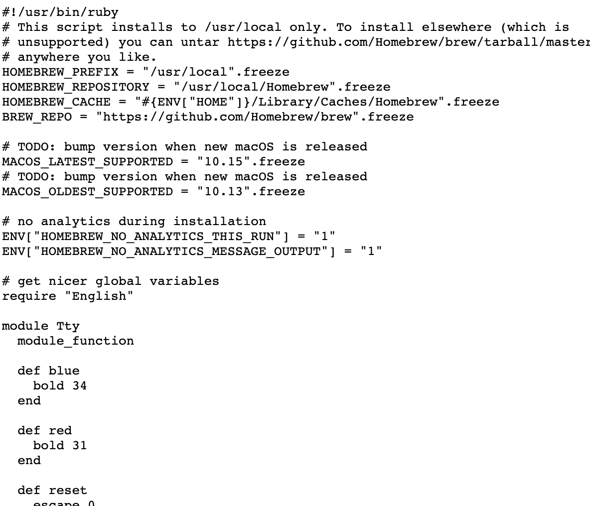
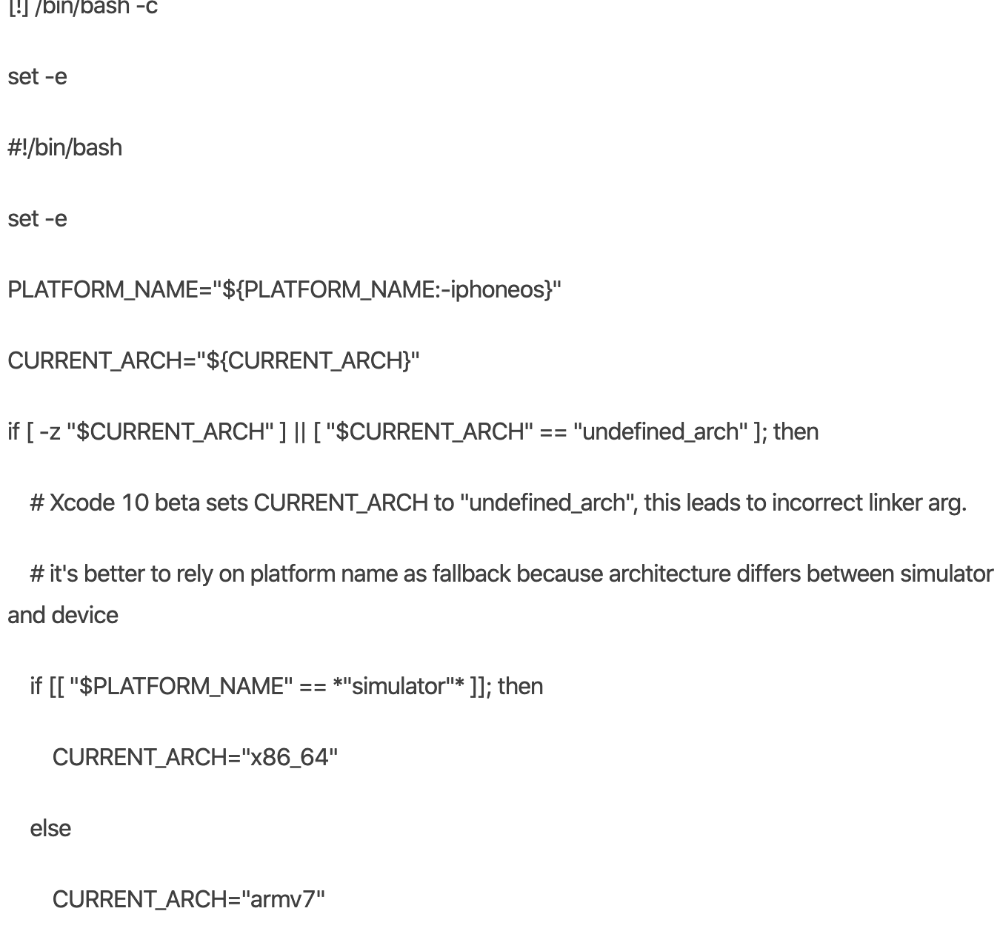

### macOS下搭建react-native开发环境


**必须安装的依赖有：Node、Watchman 和 Xcode。**

1. 安装homebrew   
推荐使用homebrew来安装node和watchman.  
在[homebrew](https://brew.sh/)官网拷贝最新的安装命令到终端执行。
```javascript 
usr/bin/ruby -e "$(curl -fsSL https://raw.githubusercontent.com/Homebrew/install/master/install)"
```

如果报以下错误：
```
 curl: (7) Failed to connect to raw.githubusercontent.com port 443: Operation
```

解决方法：  
+  在浏览器输入以下网址  
    ```
        https://raw.githubusercontent.com/Homebrew/install/master/install
    ```
    尝试是否能够打开，正常能够打开，则显示如下
    
    将此网页保存到本地并命名为```brew_install.rb```.  
* 在终端输入```$ curl```,  
    如果能够输出```url: try 'curl --help' or 'curl --manual' for more information```.
* 在终端找到进入到刚才保存的文件目录，执行以下命令  
```ruby brew_install.rb```  
将能够正常安装```homebrew```

2. 安装```node.js```、```watchman```  
```homebrew```安装成功后执行以下命令分别安装```node.js```和```watchman```  
```brew install node```  
```brew install watchman```


3. 推荐使用```yarn```替换```npm```  
```npm install -g yarn```

4. 安装xcode  
在App store搜索xcode并安装即可。

5. 创建新项目  
```npx react-native init [项目名]```

途中如果在pod install时报错：


这种错误应该是没有找到Xcode,终端输入下面命令  
```sudo xcode-select --switch /Applications/Xcode.app```  
即可正常安装

6. 运行项目  
```cd [项目名]```  
```arn react-native run-ios```