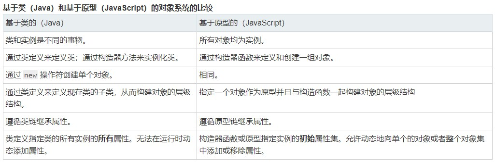
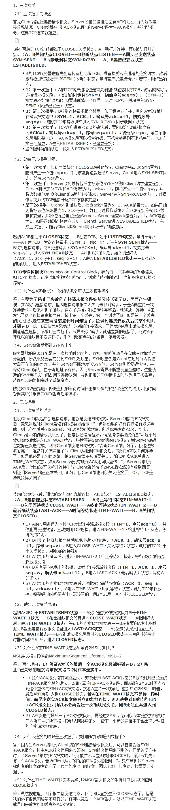
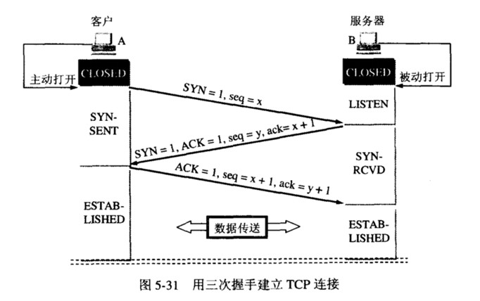
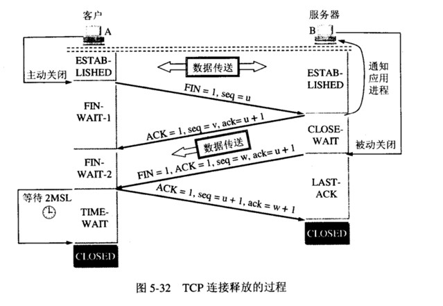
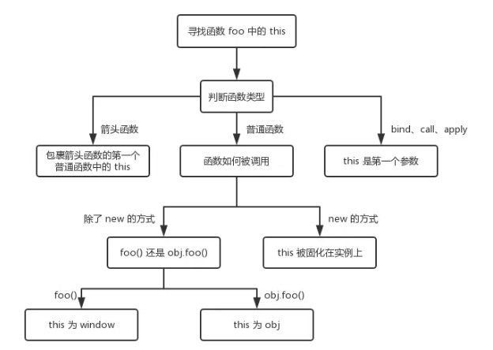

# 杂

## 1.基于类（java）和基于原型（JavaScript）的对象系统的比较



## 2.TCP ->三次握手、四次挥手

TCP(Transmission Control Protocol),是为了在不可靠的互联网络提供可靠的端到端字节流而专门设计的一个传输协议。当应用层向TCP层发送用于网间传输的、用8位字节表示的[数据流](https://baike.baidu.com/item/数据流)，TCP则把数据流分割成适当长度的报文段，最大传输段大小（[MSS](https://baike.baidu.com/item/MSS/3567770)）通常受该计算机连接的网络的数据链路层的最大传送单元（[MTU](https://baike.baidu.com/item/MTU)）限制。之后TCP把数据包传给IP层，由它来通过网络将包传送给接收端实体的TCP层 

syn：同步位          seq：初始序号   ACK：确认报文段   ack：确认号

[以下图片来自此博客]: https://www.cnblogs.com/Andya/p/7272462.html



### 三次握手

* 客户端发送 `syn`(同步序列编号) 请求，进入 `syn_send` 状态，等待确认
* 服务端接收并确认 `syn` 包后发送 `syn+ack` 包，进入 `syn_recv` 状态
* 客户端接收 `syn+ack` 包后，发送 `ack` 包，双方进入 `established` 状态



### 四次挥手

* 客户端 -- FIN --> 服务端， FIN—WAIT
* 服务端 -- ACK --> 客户端， CLOSE-WAIT
* 服务端 -- ACK,FIN --> 客户端， LAST-ACK
* 客户端 -- ACK --> 服务端，CLOSED



## 3.手写call、apply及bind函数

### `call`

```js
   Function.prototype.myCall = function(context){
    if(typeof this !== 'function'){ 
     throw new TypeError('Error')
    }

    context = context || window //context是可选参数，默认为上下文
    context.fn = this	//给context创建一个fn属性，并将值设置为需要调用的函数
    const args = [...arguments].slice(1)  //call的参数是一个列表，所以需要剥离参
    const result = context.fn(...args)//调用函数
    delete context.fn //将对象上的函数删除
    return result
   }
```

### `apply`

```js
	Function.prototype.myApply = function(context){
    if(typeof this !== 'function'){
      throw new TypeError('Error')
		}
    
    context = context || window
 		context.fn = this
    
    //处理参数和call有所区别,apply的参数是一个数组
    let result
    if(arguments[1]){
      result = context.fn(...arguments[1])
    }else{
      result = context.fn()
    }
    
    delete context.fn
    return result
  }
```

### `bind`

```js
	Function.prototype.myBind = function(context){
    //bind() 方法创建一个新的函数，在 bind() 被调用时，这个新函数的 this 被指定为 bind() 的第一个参数，
    //而其余参数将作为新函数的参数，供调用时使用。
    if(typeof this !== 'function'){
     throw new TypeError('Error')
    }

    const that = this;
    const args = [...arguments].slice(1)

    //返回一个函数
    return function F(){
     //因为返回一个函数，我们可以new F(),所以需要判断
     if(this instanceof F){
      return new that(...args,...arguments)
     }
     return that.apply(context,args.concat(...arguments))
    }
   }
//bind 返回了一个函数，对于函数来说有两种方式调用，一种是直接调用，一种是通过 new 的方式，我们先来说直接调用的方式
//对于直接调用来说，这里选择了 apply 的方式实现，但是对于参数需要注意以下情况：因为 bind 可以实现类似这样的代码 f.bind(obj, 1)(2)，所以我们需要将两边的参数拼接起来，于是就有了这样的实现 args.concat(...arguments)
//最后来说通过 new 的方式，在之前的章节中我们学习过如何判断 this，对于 new 的情况来说，不会被任何方式改变 this，所以对于这种情况我们需要忽略传入的 this
```

## 4.`new`

`new` 的原理:

1. 新生成了一个对象
2. 链接到原型
3. 绑定this
4. 返回新对象

```js
//实现new
function myNew(){
  let obj = {}
  let Con = [].shift.call(arguments)
  let obj._proto_ = Con.prototype

  let result = Con.apply(obj,arguments)
  return result instanceof Object ? result:obj
 }
```


## 5.`instacenof`和`typeof`

### `instanceof`

原理：通过判断对象的原型链中是不是能找到对应类型的`prototype`

优点：能检测array,function,object类型 

缺点:检测不了number,boolean,string

实现：

```js
 function myInstanceof(left, right) {
  let prototype = right.prototype;
  left = left.prototype;
  while (true) {
   if (left = null || left === undefined) {
    return false
   }
   if (prototype === left) {
    return true
   }
   left = left.prototype
  }
 }
```

### `typeof`

原理：JavaScript在底层存储变量的时候，会在变量的机器码的低位1-3位存储其类型信息。

- 000:对象

- 010:浮点数

- 100:字符串

- 110:布尔

- 1:整数

  特例`null`的机器码都是0，所以会被当为对象。`undefined`的机器码用-2^30整数来表示。

优点：能快速检查undefined,string,number,boolean类型

缺点：当类型为object,null,array时都会返回object,所以不能区分这三类

重点记忆：

```js
// 数值
typeof 37 === 'number';
typeof 3.14 === 'number';
typeof(42) === 'number';
typeof Math.LN2 === 'number';
typeof Infinity === 'number';
typeof NaN === 'number'; // 尽管它是 "Not-A-Number" (非数值) 的缩写
typeof Number(1) === 'number'; // Number 会尝试把参数解析成数值
typeof 42n === 'bigint';


// 字符串
typeof '' === 'string';
typeof 'bla' === 'string';
typeof `template literal` === 'string';
typeof '1' === 'string'; // 注意内容为数字的字符串仍是字符串
typeof (typeof 1) === 'string'; // typeof 总是返回一个字符串
typeof String(1) === 'string'; // String 将任意值转换为字符串，比 toString 更安全


// 布尔值
typeof true === 'boolean';
typeof false === 'boolean';
typeof Boolean(1) === 'boolean'; // Boolean() 会基于参数是真值还是虚值进行转换
typeof !!(1) === 'boolean'; // 两次调用 ! (逻辑非) 操作符相当于 Boolean()


// Symbols
typeof Symbol() === 'symbol';
typeof Symbol('foo') === 'symbol';
typeof Symbol.iterator === 'symbol';


// Undefined
typeof undefined === 'undefined';
typeof declaredButUndefinedVariable === 'undefined';
typeof undeclaredVariable === 'undefined'; 


// 对象
typeof {a: 1} === 'object';

// 使用 Array.isArray 或者 Object.prototype.toString.call
// 区分数组和普通对象
typeof [1, 2, 4] === 'object';

typeof new Date() === 'object';
typeof /regex/ === 'object'; // 历史结果请参阅正则表达式部分


// 下面的例子令人迷惑，非常危险，没有用处。避免使用它们。
typeof new Boolean(true) === 'object';
typeof new Number(1) === 'object';
typeof new String('abc') === 'object';

// 函数
typeof function() {} === 'function';
typeof class C {} === 'function'
typeof Math.sin === 'function';

// 除 Function 外的所有构造函数的类型都是 'object'
var str = new String('String');
var num = new Number(100);

typeof str; // 返回 'object'
typeof num; // 返回 'object'

var func = new Function();
typeof func; // 返回 'function'

// 括号有无将决定表达式的类型。
var iData = 99;

typeof iData + ' Wisen'; // 'number Wisen'
typeof (iData + ' Wisen'); // 'string'

//对正则表达式的判断有些浏览器不符合标准
typeof /s/ === 'function'; // Chrome 1-12 , 不符合 ECMAScript 5.1
typeof /s/ === 'object'; // Firefox 5+ , 符合 ECMAScript 5.1

//抛出错误
//在 ECMAScript 2015 之前，typeof 总能保证对任何所给的操作数返回一个字符串。即便是没有声明的标识符，typeof 也能返回 'undefined'。使用 typeof 永远不会抛出错误。
//但在加入了块级作用域的 let 和 const 之后，在其被声明之前对块中的 let 和 const 变量使用 typeof 会抛出一个 ReferenceError。块作用域变量在块的头部处于“暂存死区”，直至其被初始化，在这期间，访问变量将会引发错误。

typeof undeclaredVariable === 'undefined';

typeof newLetVariable; // ReferenceError
typeof newConstVariable; // ReferenceError
typeof newClass; // ReferenceError

let newLetVariable;
const newConstVariable = 'hello';
class newClass{};

//例外 当前所有的浏览器都暴露了一个类型为 undefined 的非标准宿主对象 document.all。
typeof document.all === 'undefined';
```

### 判断类型终极解决办法

`Object.prototype.toString.call`:该方法本质就是依托`Object.prototype.toString()`方法得到对象内部属性 `[[Class]]` 传入原始类型却能够判定出结果是因为对值进行了包装 `null` 和 `undefined` 能够输出结果是内部实现有做处理

方法封装：

```js
var type = function(data) {
      var toString = Object.prototype.toString;
      var dataType = toString
              .call(data)
              .replace(/\[object\s(.+)\]/, "$1")
              .toLowerCase()
      return dataType
};

//type(null) "null"
//type('a')  "string"
//type(undefined) "undefined"
```

## 6.V8 下的垃圾回收机制是怎么样的？	

V8 实现了准确式 GC，GC 算法采用了分代式垃圾回收机制。因此，V8 将内存（堆）分为新生代和老生代两部分。

### 新生代算法

新生代中的对象一般存活时间较短，使用 Scavenge GC 算法。

在新生代空间中，内存空间分为两部分，分别为 From 空间和 To 空间。在这两个空间中，必定有一个空间是使用的，另一个空间是空闲的。新分配的对象会被放入 From 空间中，当 From 空间被占满时，新生代 GC 就会启动了。算法会检查 From 空间中存活的对象并复制到 To 空间中，如果有失活的对象就会销毁。当复制完成后将 From 空间和 To 空间互换，这样 GC 就结束了。

### 老生代算法

老生代中的对象一般存活时间较长且数量也多，使用了两个算法，分别是标记清除算法和标记压缩算法。

在讲算法前，先来说下什么情况下对象会出现在老生代空间中：

- 新生代中的对象是否已经经历过一次 Scavenge 算法，如果经历过的话，会将对象从新生代空间移到老生代空间中。
- To 空间的对象占比大小超过 25 %。在这种情况下，为了不影响到内存分配，会将对象从新生代空间移到老生代空间中。

老生代中的空间很复杂，有如下几个空间

```js
enum AllocationSpace {
  // TODO(v8:7464): Actually map this space's memory as read-only.
  RO_SPACE,    // 不变的对象空间
  NEW_SPACE,   // 新生代用于 GC 复制算法的空间
  OLD_SPACE,   // 老生代常驻对象空间
  CODE_SPACE,  // 老生代代码对象空间
  MAP_SPACE,   // 老生代 map 对象
  LO_SPACE,    // 老生代大空间对象
  NEW_LO_SPACE,  // 新生代大空间对象

  FIRST_SPACE = RO_SPACE,
  LAST_SPACE = NEW_LO_SPACE,
  FIRST_GROWABLE_PAGED_SPACE = OLD_SPACE,
  LAST_GROWABLE_PAGED_SPACE = MAP_SPACE
};
```

在老生代中，以下情况会先启动标记清除算法：

- 某一个空间没有分块的时候
- 空间中被对象超过一定限制
- 空间不能保证新生代中的对象移动到老生代中

在这个阶段中，会遍历堆中所有的对象，然后标记活的对象，在标记完成后，销毁所有没有被标记的对象。在标记大型对内存时，可能需要几百毫秒才能完成一次标记。这就会导致一些性能上的问题。为了解决这个问题，2011 年，V8 从 stop-the-world 标记切换到增量标志。在增量标记期间，GC 将标记工作分解为更小的模块，可以让 JS 应用逻辑在模块间隙执行一会，从而不至于让应用出现停顿情况。但在 2018 年，GC 技术又有了一个重大突破，这项技术名为并发标记。该技术可以让 GC 扫描和标记对象时，同时允许 JS 运行，你可以点击 [该博客](https://v8project.blogspot.com/2018/06/concurrent-marking.html) 详细阅读。

清除对象后会造成堆内存出现碎片的情况，当碎片超过一定限制后会启动压缩算法。在压缩过程中，将活的对象像一端移动，直到所有对象都移动完成然后清理掉不需要的内存。

## 7.`Vue.$nextTick`原理

### 用法：

将回调延迟到下次 DOM 更新循环之后执行。在修改数据之后立即使用它，然后等待 DOM 更新。

`Vue`中对`DOM`的更新策略了，`Vue` 在更新 `DOM` 时是**异步**执行的。只要侦听到数据变化，`Vue` 将开启一个事件队列，并缓冲在同一事件循环中发生的所有数据变更。如果同一个 `watcher` 被多次触发，只会被推入到事件队列中一次。这种在缓冲时去除重复数据对于避免不必要的计算和 `DOM` 操作是非常重要的。然后，在下一个的事件循环“tick”中，`Vue` 刷新事件队列并执行实际 (已去重的) 工作。

当我们更新数据时，此时该组件不会立即重新渲染。当刷新事件队列时，组件会在下一个事件循环“tick”中重新渲染。所以当我们更新完数据后，此时又想基于更新后的 `DOM` 状态来做点什么，此时我们就需要使用`Vue.nextTick(callback)`，把基于更新后的`DOM` 状态所需要的操作放入回调函数`callback`中，这样回调函数将在 `DOM` 更新完成后被调用。

### 内部原理

1. 能力检测

2. 根据能力检测以不同方式执行回调队列

   

`Vue` 在内部对异步队列尝试使用原生的 `Promise.then`、`MutationObserver` 和 `setImmediate`，如果执行环境不支持，则会采用 `setTimeout(fn, 0)` 代替。

宏任务耗费的时间是大于微任务的，所以在浏览器支持的情况下，优先使用微任务。如果浏览器不支持微任务，使用宏任务；但是，各种宏任务之间也有效率的不同，需要根据浏览器的支持情况，使用不同的宏任务。

```js
let microTimerFunc
let macroTimerFunc
let useMacroTask = false

/* 对于宏任务(macro task) */
// 检测是否支持原生 setImmediate(高版本 IE 和 Edge 支持)
if (typeof setImmediate !== 'undefined' && isNative(setImmediate)) {
    macroTimerFunc = () => {
        setImmediate(flushCallbacks)
    }
}
// 检测是否支持原生的 MessageChannel
else if (typeof MessageChannel !== 'undefined' && (
    isNative(MessageChannel) ||
    // PhantomJS
    MessageChannel.toString() === '[object MessageChannelConstructor]'
)) {
    const channel = new MessageChannel()
    const port = channel.port2
    channel.port1.onmessage = flushCallbacks
    macroTimerFunc = () => {
        port.postMessage(1)
    }
}
// 都不支持的情况下，使用setTimeout
else {
    macroTimerFunc = () => {
        setTimeout(flushCallbacks, 0)
    }
}

/* 对于微任务(micro task) */
// 检测浏览器是否原生支持 Promise
if (typeof Promise !== 'undefined' && isNative(Promise)) {
    const p = Promise.resolve()
    microTimerFunc = () => {
        p.then(flushCallbacks)
    }
}
// 不支持的话直接指向 macro task 的实现。
else {
    // fallback to macro
    microTimerFunc = macroTimerFunc
}
```

首先声明了两个变量： `microTimerFunc` 和 `macroTimerFunc` ，它们分别对应的是 `micro task` 的函数和 `macro task` 的函数。对于 `macro task` 的实现，优先检测是否支持原生 `setImmediate`，这是一个高版本 `IE` 和`Edge` 才支持的特性，不支持的话再去检测是否支持原生的 `MessageChannel`，如果也不支持的话就会降级为 `setTimeout 0`；而对于 `micro task` 的实现，则检测浏览器是否原生支持 `Promise`，不支持的话直接指向 `macro task` 的实现。

```js
const callbacks = []   // 回调队列
let pending = false    // 异步锁

// 执行队列中的每一个回调
function flushCallbacks () {
    pending = false     // 重置异步锁
    // 防止出现nextTick中包含nextTick时出现问题，在执行回调函数队列前，提前复制备份并清空回调函数队列
    const copies = callbacks.slice(0)
    callbacks.length = 0
    // 执行回调函数队列
    for (let i = 0; i < copies.length; i++) {
        copies[i]()
    }
}

export function nextTick (cb?: Function, ctx?: Object) {
    let _resolve
    // 将回调函数推入回调队列
    callbacks.push(() => {
        if (cb) {
            try {
                cb.call(ctx)
            } catch (e) {
                handleError(e, ctx, 'nextTick')
            }
        } else if (_resolve) {
            _resolve(ctx)
        }
    })
    // 如果异步锁未锁上，锁上异步锁，调用异步函数，准备等同步函数执行完后，就开始执行回调函数队列
    if (!pending) {
        pending = true
        if (useMacroTask) {
            macroTimerFunc()
        } else {
            microTimerFunc()
        }
    }
    // 如果没有提供回调，并且支持Promise，返回一个Promise
    if (!cb && typeof Promise !== 'undefined') {
        return new Promise(resolve => {
            _resolve = resolve
        })
    }
}
```

先来看 `nextTick`函数，该函数的主要逻辑是：先把传入的回调函数 `cb` 推入 回调队列`callbacks` 数组，同时在接收第一个回调函数时，执行能力检测中对应的异步方法（异步方法中调用了回调函数队列）。最后一次性地根据 `useMacroTask` 条件执行 `macroTimerFunc` 或者是 `microTimerFunc`，而它们都会在下一个 tick 执行 `flushCallbacks`，`flushCallbacks` 的逻辑非常简单，对 `callbacks` 遍历，然后执行相应的回调函数。

1. 如何保证只在接收第一个回调函数时执行异步方法？

   `nextTick`源码中使用了一个异步锁的概念，即接收第一个回调函数时，先关上锁，执行异步方法。此时，浏览器处于等待执行完同步代码就执行异步代码的情况。

2. 执行 `flushCallbacks` 函数时为什么需要备份回调函数队列？执行的也是备份的回调函数队列？

   因为，会出现这么一种情况：`nextTick` 的回调函数中还使用 `nextTick`。如果 `flushCallbacks` 不做特殊处理，直接循环执行回调函数，会导致里面`nextTick` 中的回调函数会进入回调队列。

## 8.`this`指向

