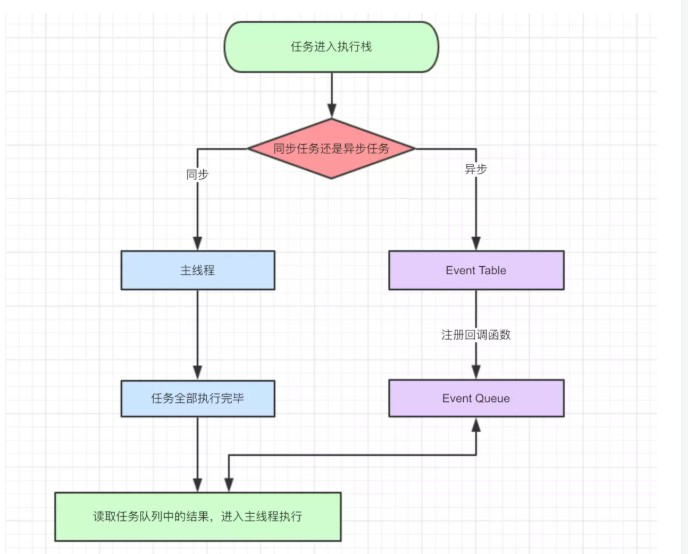

## javascript执行机制  

### 单线程
  js的一切多线程都是用单线程模拟出来的
  * 线程是进程的中的一个小单位。
  * 单线程的好处就是可以没有锁的问题，节约上下文切换时间。
### event loop

* 同步和异步任务分别进入不同的执行"场所"，同步的进入主线程，异步的进入Event Table并注册函数。
* 当指定的事情完成时，Event Table会将这个函数移入Event Queue。
* 主线程内的任务执行完毕为空，会去Event Queue读取对应的函数，进入主线程执行。
* 上述过程会不断重复，也就是常说的Event Loop(事件循环)。

### setTimeout

* ```setTimeout```这个函数，是经过指定时间后，把要执行的任务加入到Event Queue中，又因为是单线程任务要一个一个执行，如果前面的任务需要的时间太久，那么只能等着，导致真正的延迟时间远远大于3秒。
* ```setTimeout(fn,0)```的含义是，指定某个任务在主线程最早可得的空闲时间执行，意思就是不用再等多少秒了，只要主线程执行栈内的同步任务全部执行完成，栈为空就马上执行。setTimeout要补充的是，即便主线程为空，0毫秒实际上也是达不到的。根据HTML的标准，最低是4毫秒。

### setInterval
对于```setInterval(fn,ms)```来说，我们已经知道不是每过ms秒会执行一次fn，而是每过ms秒，会有fn进入Event Queue。一旦```setInterval```的回调函数fn执行时间超过了延迟时间ms，那么就完全看不出来有时间间隔了。

### Promise与process.nextTick(callback)
```process.nextTick(callback)```类似node.js版的"setTimeout"，在事件循环的下一次循环中调用 callback 回调函数  
* macro-task(宏任务)：包括整体代码script，setTimeout，setInterval，etImmediate ，I/O ，UI rendering
* micro-task(微任务)：Promise，process.nextTick

事件循环的顺序，决定js代码的执行顺序。进入整体代码(宏任务)后，开始第一次循环。接着执行所有的微任务。然后再次从宏任务开始，找到其中一个任务队列执行完毕，再执行所有的微任务。