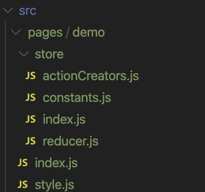
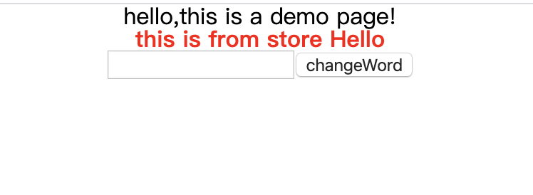
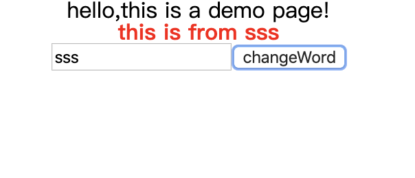

# react项目创建与配置模版  
## 技术栈与库：
* [react](https://zh-hans.reactjs.org/)
* [redux](https://www.redux.org.cn/)
* [react-redux](https://react-redux.js.org/introduction/quick-start)
* [redux-thunk](https://github.com/reduxjs/redux-thunk)
* [styled-components](https://styled-components.com/)
* [Immutable.JS](https://cn.redux.js.org/docs/recipes/UsingImmutableJS.html)
* [react-router](https://reacttraining.com/react-router/web/guides/quick-start)
* [redux-immutable](https://github.com/gajus/redux-immutable)
## 创建项目

1. 使用以下代码创建项目
```javascript
npx create-react-app 项目名
```

2. 引入```styled-components```  
[styled-components](https://styled-components.com/)能够让我们在js文件里编写css代码
```javascript
npm install --save styled-components
```

3. 重置浏览器样式  
在```src```目录下新建```style.js```文件,在文件中引入```styled-components```
```javascript
import {createGlobalStyle} from 'styled-components'
```
并添加以下重置浏览器样式代码
```javascript
export const GlobalStyled = createGlobalStyle `
    /* http://meyerweb.com/eric/tools/css/reset/ 
    v2.0 | 20110126
    License: none (public domain)
    */

    html, body, div, span, applet, object, iframe,
    h1, h2, h3, h4, h5, h6, p, blockquote, pre,
    a, abbr, acronym, address, big, cite, code,
    del, dfn, em, img, ins, kbd, q, s, samp,
    small, strike, strong, sub, sup, tt, var,
    b, u, i, center,
    dl, dt, dd, ol, ul, li,
    fieldset, form, label, legend,
    table, caption, tbody, tfoot, thead, tr, th, td,
    article, aside, canvas, details, embed, 
    figure, figcaption, footer, header, hgroup, 
    menu, nav, output, ruby, section, summary,
    time, mark, audio, video {
        margin: 0;
        padding: 0;
        border: 0;
        font-size: 100%;
        font: inherit;
        vertical-align: baseline;
    }
    /* HTML5 display-role reset for older browsers */
    article, aside, details, figcaption, figure, 
    footer, header, hgroup, menu, nav, section {
        display: block;
    }
    body {
        line-height: 1;
    }
    ol, ul {
        list-style: none;
    }
    blockquote, q {
        quotes: none;
    }
    blockquote:before, blockquote:after,
    q:before, q:after {
        content: '';
        content: none;
    }
    table {
        border-collapse: collapse;
        border-spacing: 0;
    }
`
```
在```App.js```文件中引入```style.js```文件，并作为组建标签在最外层```div```标签内使用
```javascript
  return (
      <div>
        <GlobalStyled/>
         //其它code
      </div>
  );
```

4. 引入```redux```  
[redux](https://www.redux.org.cn/)是 JavaScript 状态容器，提供可预测化的状态管理。
```javascript
npm install --save redux
```
推荐引入以下附加包
```javascript
npm install --save react-redux//能够派发store、props、dispatch等
npm install --save-dev redux-devtools//调试工具
```

5. 引入```redux-thunk```中间件  
[redux-thunk](https://github.com/reduxjs/redux-thunk)主要的功能就是可以让我们dispatch一个函数，而不只是普通的 Object。
```javascript
npm install redux-thunk
```

6. 引入```immutable.js```  
[Immutable.JS](https://cn.redux.js.org/docs/recipes/UsingImmutableJS.html) 旨在以一种高性能的方式提供不可变，以克服 JavaScript 不可变的局限性
```javascript
npm install immutable
```

7. 引入```redux-immutable```  
[redux-immutable](https://github.com/gajus/redux-immutable)在使用了```immutable.js```的情况下，如果需要合并reducer，则需引入此库。[详细理由](https://cn.redux.js.org/docs/recipes/reducers/BeyondCombineReducers.html)

8. 引入```react-router```  
[react-router](https://reacttraining.com/react-router/web/guides/quick-start)路由管理
```javascript
npm install react-router-dom
```

9. 推荐引入```react-transition-group```  
[react-transition-group](https://reactcommunity.org/react-transition-group/)能够使我们创建一些过渡动画
```javascript
npm install react-transition-group --save
```

## 项目配置
1. 创建```store```  
* 在```src```文件夹下创建```store```文件夹，在文件夹内创建```index.js```和```reducer.js```文件
* 在```index.js```文件中创建```store```，引入下列代码
```javascript
import {
    createStore,
    compose,
    applyMiddleware, 
} from 'redux';
import thunk from 'redux-thunk';
import reducer from './reducer';
const composeEnhancers = window.__REDUX_DEVTOOLS_EXTENSION_COMPOSE__ || compose;

const store = createStore(reducer,composeEnhancers(applyMiddleware(thunk)));

export default store;
```
* 在```reducer.js```文件中引入```redux-immutable```,创建```reducer```  
```javascript
import {combineReducers} from 'redux-immutable'

export default combineReducers({
    
})
```

2. 在目录```src```下创建以下目录结构文件  


3. 各文件编写  
* ```index.js```文件  
```js
import React, { Component } from 'react'
import { connect } from 'react-redux'
import { DemoText, StoreText } from './style'
import {actionCreators} from './store'

class Demo extends Component {
    render() {
        const { storeHello } = this.props;
        return (
            <DemoText>
                hello,this is a demo page!<br />
                <StoreText>this is from {storeHello}</StoreText>
                <input ref={(input)=>{this.word=input}}></input>
                <button onClick={()=>this.props.changeWord(this.word)}>changeWord</button>
            </DemoText>
        )
    }
}

const mapState = (state) => ({
    storeHello: state.getIn(['demo', 'storeHello'])
})

const mapDispatch = (dispatch) => ({
    changeWord(word){
        if(!word.value) return 
        dispatch(actionCreators.changeStoreWord(word.value))
    }
})
export default connect(mapState, mapDispatch)(Demo)
```

* ```style.js```文件  
```js
import styled from 'styled-components'
export const DemoText = styled.div`
    text-align:center;
`
export const StoreText = styled.div`
    color:red;
    font-weight:bold;
`
```

* ```demo/store/index.js```文件
```js
import reducer from './reducer'
import * as actionCreators from './actionCreators'
import * as constants from './constants'


export {
    reducer,
    actionCreators,
    constants
}
```

* ```demo/store/reducer.js```文件  
```js
import {fromJS} from 'immutable'
import * as constants from './constants'
const defaultState=fromJS({
    storeHello:'store Hello'
})

export default (state = defaultState, action) => {
    switch (action.type) {
        case constants.CHANGE_WORD:
            return state.set('storeHello', action.word)
        default:
            return state
    }
}
```

* ```demo/store/actionCreators.js```文件  
```js
import * as constants from './constants'

export const changeStoreWord = (value) => (
    {
        type: constants.CHANGE_WORD,
        word: value
    }
)
```

* ```demo/store/constants.js```文件  
```js
export const CHANGE_WORD = 'demo/CHANGE_WORD';
``` 

4. 完善```store/reducer.js```文件  
```js
import {combineReducers} from 'redux-immutable'
import {
    reducer as demoReducer
}
from '../pages/demo/store'

export default combineReducers({
    demo:demoReducer,
})
```

5. ```App.js```文件配置  
```js
import React from 'react';
import {GlobalStyled} from './style'
import store from './store'
import {BrowserRouter,Route} from 'react-router-dom'
import {Provider} from 'react-redux'
import Demo from './pages/demo'


function App() {
  return (
    <Provider store={store}>
      <div>
        <GlobalStyled/>
        <BrowserRouter>
          <div>
            <Route path='/' exact component={Demo}></Route>
          </div>
        </BrowserRouter>
      </div>
    </Provider>
  );
}

export default App;

```

6. 项目运行  
```js
npm start
```
效果：




## 总结  
使用上面的步骤就能够搭建一个通用的大型项目，懒得一步步配置的可以直接克隆[github](https://github.com/qixiaobro/react-app-template)仓库模版，各种库的使用参考demo页面的代码，也可以去各官网了解每个库的作用以及使用。我也将会在后续针对各个库写一些总结。


